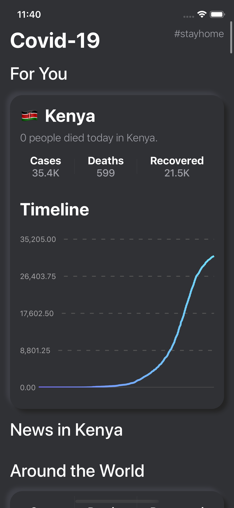
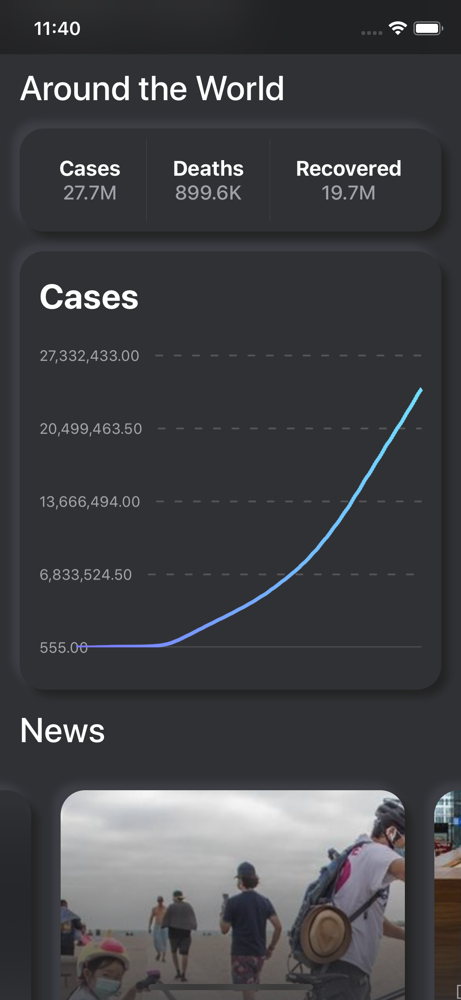
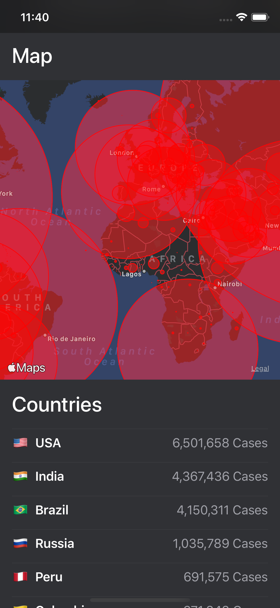
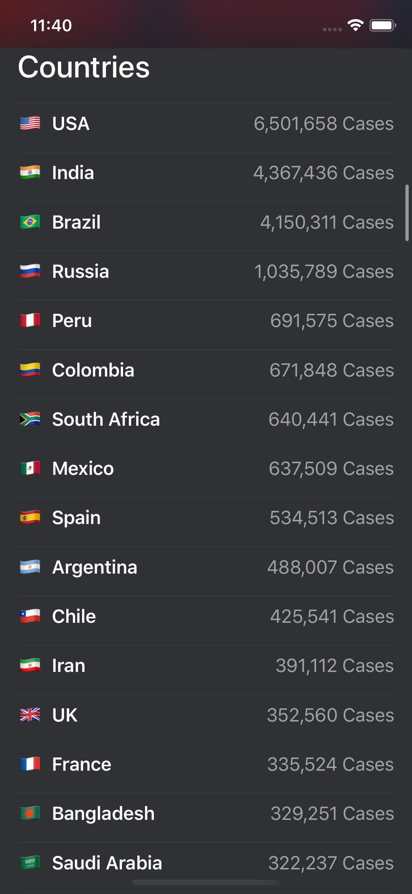

# CovidUI

CovidUI is a simple App to Track the status of Covid-19 around the World.

It's querying the data from [CovidQL](https://github.com/nerdsupremacist/CovidQL) which is loading data from [NovelCOVID](https://github.com/novelcovid/api)

Visualisation of the data was made possible using [Graphaello](https://github.com/nerdsupremacist/Graphaello); A tool to use GraphQL directly from SwiftUI.

This App is intended as an experiment in API and UX design. It uses GraphQL and a set of experimental tools to integrate it with SwiftUI. It is not intended to be your main source of information. Make sure you consult multiple sources when it comes to informing yourself about sensitive topics.

.........................

.........................

.........................

## How does this work

